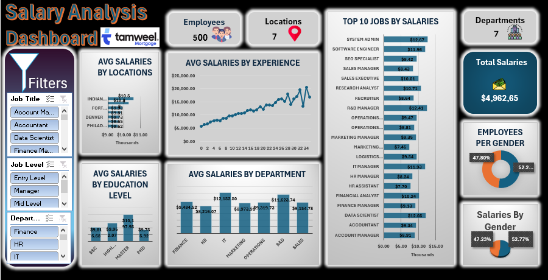

# HR-Salary-Analysis-Dashboard

📌 Problem Statement 
The HR department at Tamweel Mortgage faced challenges in maintaining a transparent and competitive salary structure. Without a centralized data view, it was difficult to:

Identify salary disparities between departments and locations.

Understand the direct correlation between years of experience and salary growth.

Track gender pay equity and employee distribution across different job levels.

Make data-driven decisions regarding promotions and annual increments.

🛠️ Data Analysis Process 
Data Cleaning: Used Power Query to handle missing values, format job titles, and categorize experience levels.

Data Modeling: Established relationships between different data tables to allow seamless filtering.

Analysis: Created Pivot Tables to calculate average salaries, headcounts, and percentage distributions.

Visualization: Designed an interactive dashboard using Advanced Excel Charts, Slicers, and Timelines.

📊 Key Findings & Results 
After analyzing the data of 500 employees across 7 locations, here are the main insights:

Top Earners: System Admins and R&D Managers have the highest average salaries ($12.6k+).

Experience Impact: There is a consistent upward trend in salary as years of experience increase, with a notable peak around the 30-year mark.

Departmental Insights: The IT department holds the highest average salary ($12,152), followed closely by R&D.

Education Premium: Employees with a Master’s degree earn significantly more on average ($10.1k) compared to those with a BSc ($9.8k).

Diversity Metrics: The workforce is fairly balanced, with 52.2% male and 47.8% female employees, though salary allocation shows a slight variance (52.77% vs 47.23%).

🚀 Impact
This dashboard provides leadership with a "single source of truth," reducing the time spent on manual reporting by 80% and enabling more equitable budget allocation for the upcoming fiscal year.
